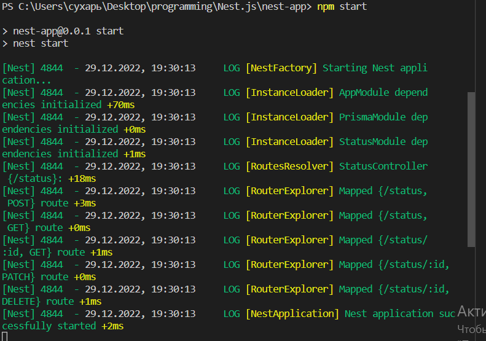
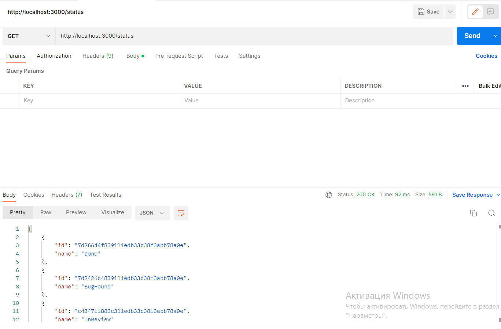
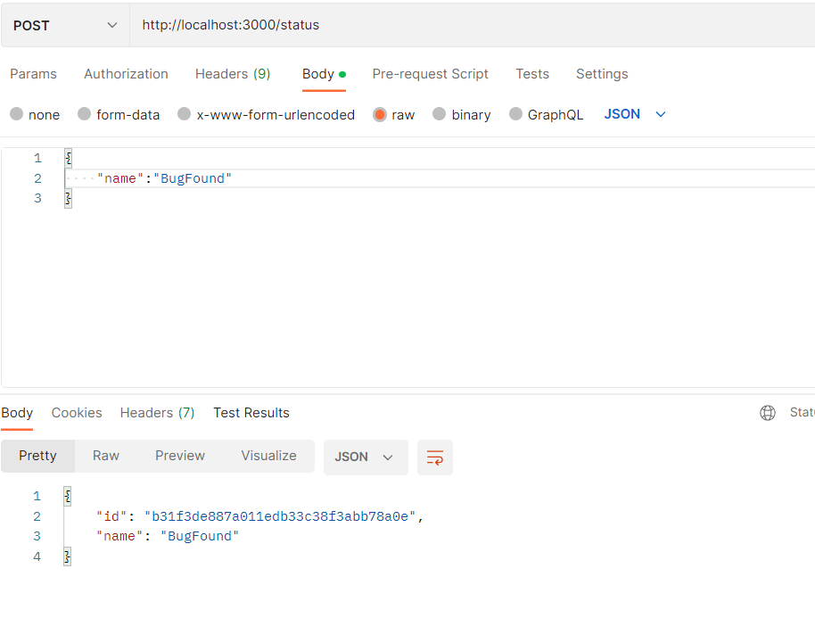
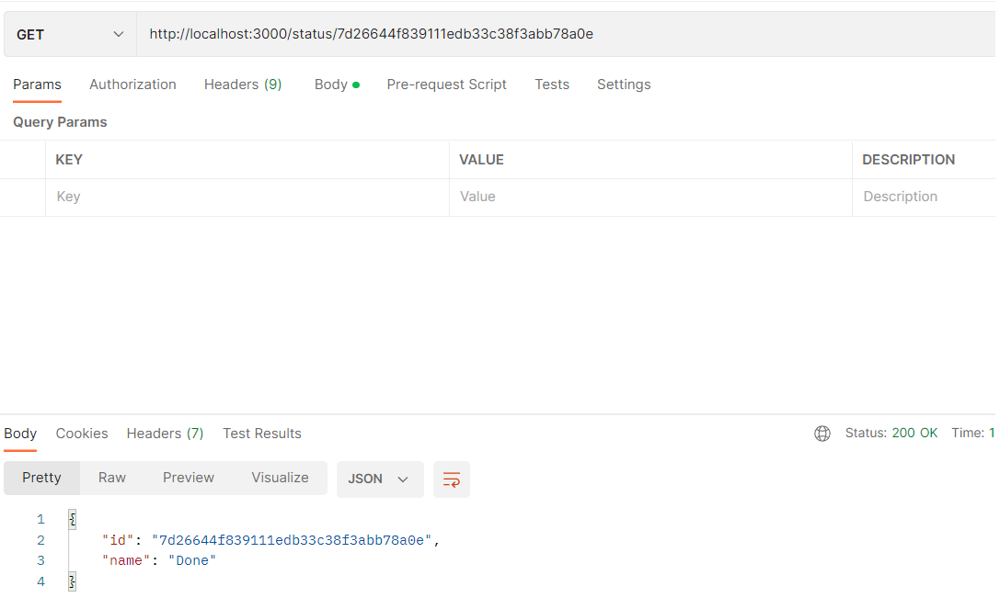
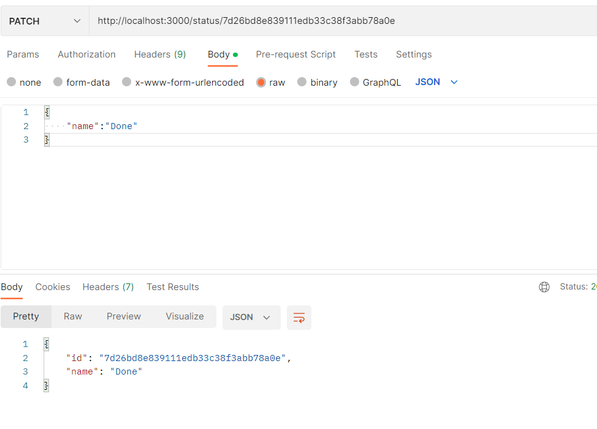
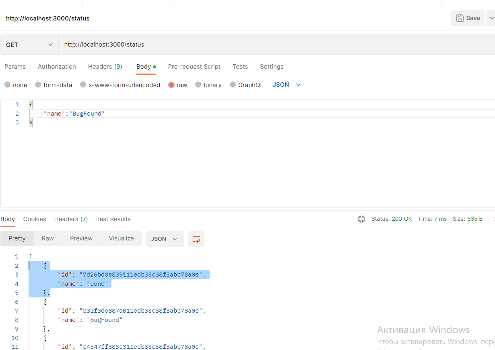
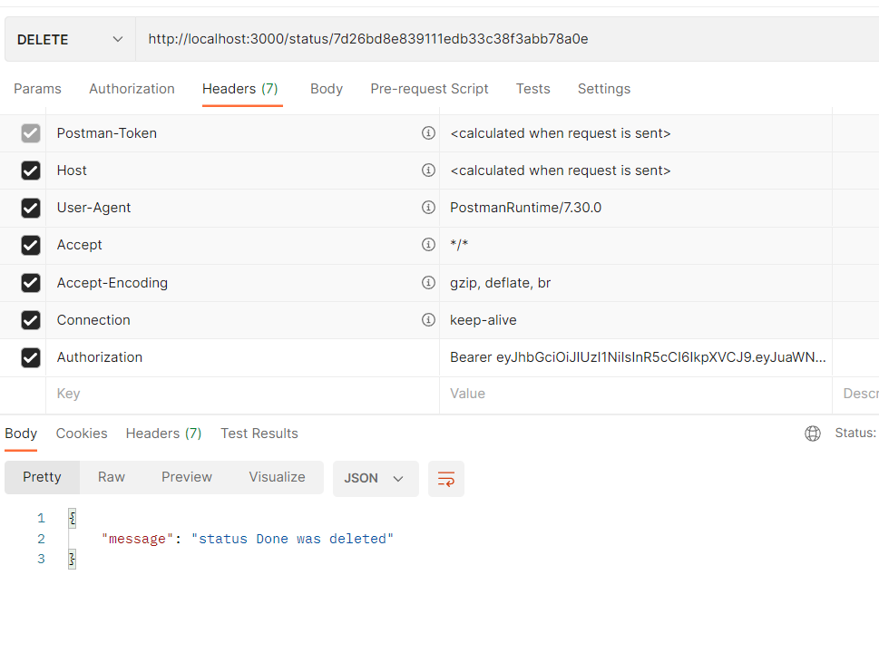
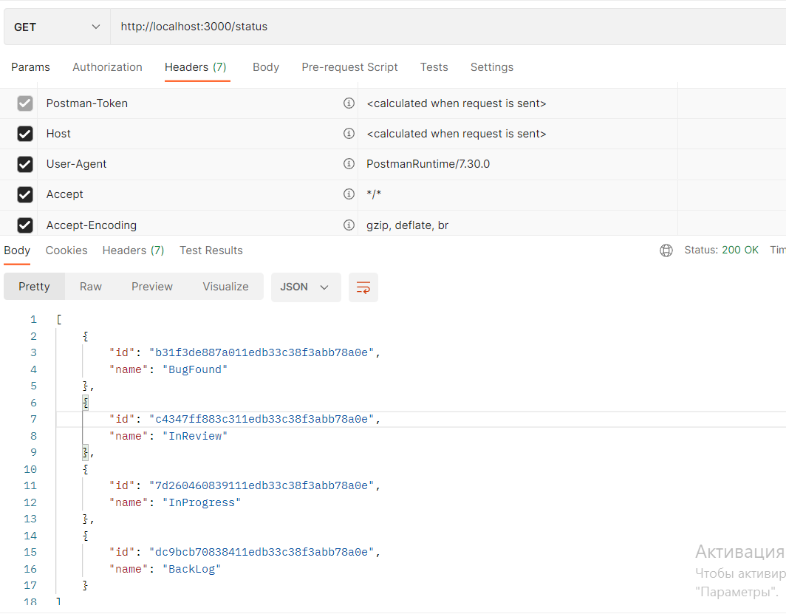

# Тестування працездатності системи

## Термінал сервера

## Відображення всіх сутностей

## Додавання сутності (CREATE)

## Зчитування сутності по id (READ)

## Оновлення сутності по id (UPDATE)

## Видалення сутності (DELETE)

### Початковий стан 

### Запит

### Результат

